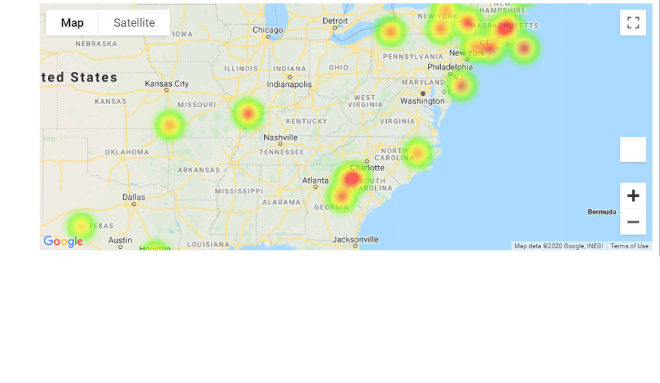
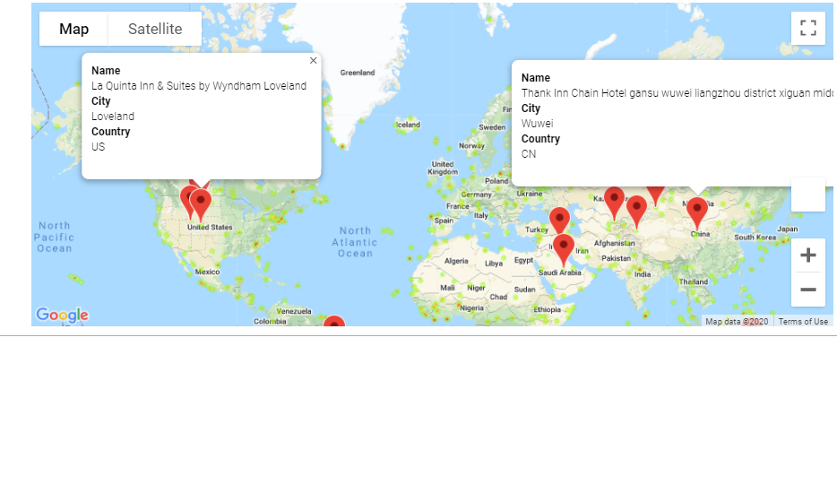
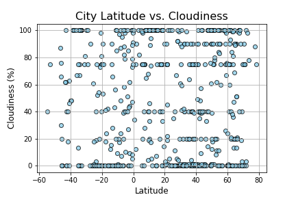
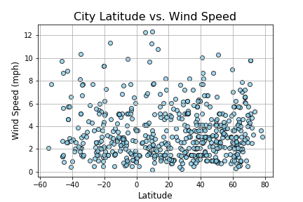

# What's the Weather Like?

## Background
Whether financial, political, or social -- data's true power lies in its ability to answer questions definitively. So let's take what you've learned about Python requests, APIs, and JSON traversals to answer a fundamental question: "What's the weather like as we approach the equator?"
Now, we know what you may be thinking: "Duh. It gets hotter..."
But, if pressed, how would you prove it?

##  WeatherPy
WeatherPy
The objective is to write a Python script to visualize the weather of 500+ cities across the world of varying distance from the equator using CityPy, a simple Python library, and the OpenWeatherMap API.

The visualizations includce a series of scatter plots to showcase the following relationships:

Temperature (F) vs. Latitude Humidity (%) vs. Latitude Cloudiness (%) vs. Latitude Wind Speed (mph) vs. Latitude

The script accomplishes the following:

Randomly selects at least 500 unique (non-repeat) cities based on latitude and longitude.

Performs a weather check on each of the cities using a series of successive API calls.

Includes a print log of each city as it's being processed with the city number and city name.

Saves both a CSV of all data retrieved and png images for each scatter plot.

## Observable Trends
1.As expected, there is a strong correlation between the latitude and the max temperature values. The weather tends to get hotter as we approach equator. However, the maximum temperature is not exactly at the equator but slightly above (approx. 20o – 25o) the equator.

2.The humidity and cloudiness do not seem to be correlated with latitude. The values are spread from minimum to maximum across latitude.

3.The wind speed value is also not correlated to the latitude. And most of the cities seem to have wind speed values below 6 mph.

## Part II - VacationPy
Now let's use your skills in working with weather data to plan future vacations. Use jupyter-gmaps and the Google Places API for this part of the assignment.

Note: if you having trouble displaying the maps try running jupyter nbextension enable --py gmaps in your environment and retry.

Create a heat map that displays the humidity for every city from the part I of the homework.

Narrow down the DataFrame to find your ideal weather condition. For example:

A max temperature lower than 80 degrees but higher than 70.

Wind speed less than 10 mph.

Zero cloudiness.

Drop any rows that don't contain all three conditions. You want to be sure the weather is ideal.

Note: Feel free to adjust to your specifications but be sure to limit the number of rows returned by your API requests to a reasonable number.

Using Google Places API to find the first hotel for each city located within 5000 meters of your coordinates.

Plot the hotels on top of the humidity heatmap with each pin containing the Hotel Name, City, and Country.

## Analysis
WeatherPy
1. There is very good corelation between temperature and the lalitude. We see in both hemispheres, that as we go closer to the equator the temperature increases.
2. There is no corelation between humididity or cloudiness and lalitude in both the hemispheres.
3. There is some level of corelation between Laltitude and Wind speed. As we move away from the equator towards the poles, we notice higher wind speeds. 
